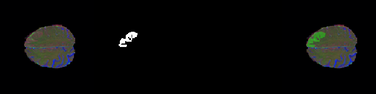
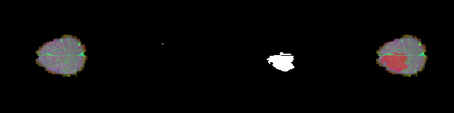
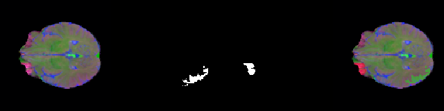

## 🧠 Brain Tumor Segmentation using U-Net on BraTS2021


A research-oriented deep learning pipeline for multimodal brain tumor segmentation using a custom U-Net architecture trained on the **BraTS2021** dataset.

This project investigates how different segmentation loss functions influence:
- tumor sensitivity,
- recall-oriented behavior,
- class imbalance handling,
- and cross-dataset generalization.

Unlike many segmentation repositories that only report a single Dice score, this project includes:
- stratified tumor-size evaluation,
- tumor subregion analysis,
- qualitative failure-case interpretation,
- and external validation on TCGA-LGG.

------------------------------------------------------------------------

## 🚀 Project Highlights

- Custom U-Net architecture implemented using TensorFlow/Keras
- Comparative loss-function experimentation:
  - BCE Loss
  - BCE + Dice Loss
  - Focal Tversky Loss
- Multimodal MRI fusion:
  - FLAIR
  - T1ce
  - T2
- Patient-wise train/validation/test splitting
- Stratified evaluation across tumor sizes
- Tumor subregion analysis:
  - Enhancing Tumor (ET)
  - Tumor Core (TC)
- External validation on TCGA-LGG
- Qualitative analysis of:
  - best predictions,
  - worst predictions,
  - and small-tumor failure cases
- Structured preprocessing and training workflow

------------------------------------------------------------------------

## 📦 Dataset

This project uses the **BraTS2021 (Brain Tumor Segmentation Challenge)** dataset.

The dataset contains multimodal MRI scans with expert-annotated tumor masks.

### MRI Modalities Used

| Channel | MRI Modality | Purpose |
|---|---|---|
| Channel 1 | FLAIR | Highlights edema and diffuse abnormalities |
| Channel 2 | T1ce | Highlights enhancing tumor regions |
| Channel 3 | T2 | Captures fluid and lesion boundaries |

### Dataset Processing

Preprocessing pipeline:
- Patient-wise dataset splitting
- Slice-wise extraction from 3D MRI volumes
- Z-score normalization
- Multimodal channel fusion
- Empty-slice balancing
- Image resizing
- Binary mask generation

### Training Resolution

```text
160 × 160 × 3
```

### Dataset Split

| Split | Ratio |
|---|---|
| Train | 70% |
| Validation | 15% |
| Test | 15% |

### Final Split Statistics

| Dataset | Patients |
|---|---|
| Train | 875 |
| Validation | 188 |
| Test | 188 |

------------------------------------------------------------------------

## 🏗️ Model Architecture

A custom encoder-decoder U-Net architecture was implemented using TensorFlow/Keras.

### Architecture Characteristics

- Symmetric encoder-decoder design
- Skip connections for spatial recovery
- Batch Normalization
- ReLU activations
- Bottleneck dropout regularization
- Transposed convolution upsampling

### Architecture Summary

Standard encoder-decoder U-Net architecture with skip connections and transposed-convolution upsampling.

------------------------------------------------------------------------

## ⚙️ Loss Functions Investigated

Three different segmentation losses were experimentally evaluated.

### BCE Loss

Characteristics:
- Stable optimization
- Strong precision-oriented behavior
- Cleaner segmentation masks
- Lower false-positive activations

### BCE + Dice Loss

Characteristics:
- Improved overlap consistency
- Better Dice optimization
- Smoother segmentation boundaries
- More balanced overlap behavior

### Focal Tversky Loss (Final Model)

Characteristics:
- Higher recall-oriented behavior
- Better difficult-region sensitivity
- Improved small-tumor detection
- Stronger class-imbalance handling

This model was selected as the final model due to its superior recall-oriented segmentation performance.

------------------------------------------------------------------------

## 🛠️ Training Configuration

### Hardware

| Component | Details |
|---|---|
| GPU | NVIDIA GTX 1650 |
| Framework | TensorFlow 2.10 |
| OS | Windows |

### Hyperparameters

| Parameter | Value |
|---|---|
| Epochs | 30 |
| Batch Size | 2 |
| Learning Rate | 0.00007 |
| Image Size | 160 |
| Seed | 42 |

### Data Augmentation

Standard spatial augmentation techniques were applied during training to improve robustness and generalization.

------------------------------------------------------------------------

## 📊 Evaluation Methodology

This project evaluates segmentation performance from multiple perspectives instead of relying on a single Dice score.

### Standard Segmentation Metrics

The following metrics were computed:
- Dice Coefficient
- IoU (Jaccard Index)
- Precision
- Recall

### Size-Stratified Evaluation

Tumor slices were categorized into:
- Small tumors
- Medium tumors
- Large tumors

This helps evaluate robustness across varying tumor sizes.

### Tumor Subregion Analysis

| Region | Description |
|---|---|
| ET | Enhancing Tumor |
| TC | Tumor Core |

### External Validation

The final model was evaluated on the **TCGA-LGG** dataset to study cross-dataset generalization and domain-shift robustness.

------------------------------------------------------------------------

## 📈 Experimental Results

### Stratified Slice-Level Metrics

#### BCE Loss

| Tumor Size | Dice | IoU | Recall |
|---|---|---|---|
| Small | 0.5064 | 0.4237 | 0.5034 |
| Medium | 0.8667 | 0.7883 | 0.8374 |
| Large | 0.9161 | 0.8537 | 0.8839 |

---

#### BCE + Dice Loss

| Tumor Size | Dice | IoU | Recall |
|---|---|---|---|
| Small | 0.4931 | 0.4136 | 0.5045 |
| Medium | 0.8567 | 0.7748 | 0.8436 |
| Large | 0.9084 | 0.8423 | 0.8863 |

---

#### Focal Tversky Loss (Final)

| Tumor Size | Dice | IoU | Recall |
|---|---|---|---|
| Small | 0.5430 | 0.4461 | 0.6424 |
| Medium | 0.8563 | 0.7670 | 0.9017 |
| Large | 0.9084 | 0.8394 | 0.9215 |

------------------------------------------------------------------------

## 🧪 Tumor Subregion Metrics

### BCE Loss

| Region | Dice | IoU | Precision | Recall |
|---|---|---|---|---|
| ET | 0.3827 | 0.2513 | 0.2653 | 0.8733 |
| TC | 0.5503 | 0.4046 | 0.4315 | 0.9006 |

---

### BCE + Dice Loss

| Region | Dice | IoU | Precision | Recall |
|---|---|---|---|---|
| ET | 0.3726 | 0.2438 | 0.2576 | 0.8617 |
| TC | 0.5360 | 0.3907 | 0.4261 | 0.8883 |

---

### Focal Tversky Loss (Final)

| Region | Dice | IoU | Precision | Recall |
|---|---|---|---|---|
| ET | 0.3546 | 0.2276 | 0.2329 | 0.9321 |
| TC | 0.5110 | 0.3650 | 0.3774 | 0.9461 |

------------------------------------------------------------------------

## 🖼️ Qualitative Visualization Results

The repository contains extensive qualitative visualizations for all three loss functions.

Visualization categories include:
- Best segmentation cases
- Worst segmentation cases
- Small-tumor failure cases

Each category contains:
- prediction overlays,
- segmentation outputs,
- qualitative failure examples,
- and optimization-behavior comparisons.

These visualizations help analyze:
- lesion boundary quality,
- false positives,
- missed tumor regions,
- and small-tumor sensitivity.

------------------------------------------------------------------------

## 🖼️ Qualitative Visualization Results

The following examples illustrate how different optimization objectives influence segmentation behavior.

### BCE Loss — Best Segmentation Example


### BCE + Dice Loss — Best Segmentation Example


### Focal Tversky Loss — Best Segmentation Example


------------------------------------------------------------------------

## ⚠️ Small Tumor Failure Cases

### BCE Loss — Failure Example



### BCE + Dice Loss — Failure Example



### Focal Tversky Loss — Failure Example



------------------------------------------------------------------------

## 🔬 Qualitative Analysis

The qualitative outputs reveal clear optimization tradeoffs between the three loss functions.

### BCE Model
- Cleaner masks
- Conservative prediction behavior
- Lower false positives
- Weak small-tumor sensitivity

### BCE + Dice Model
- Improved overlap consistency
- Smoother segmentation boundaries
- Better region continuity
- Moderate robustness on difficult slices

### Focal Tversky Model
- Strong difficult-region sensitivity
- Better small-tumor detection
- Recall-oriented segmentation behavior
- Increased over-segmentation tendency

### Optimization Behavior Comparison

| Model | Observed Behavior |
|---|---|
| BCE | Conservative / precision-oriented |
| BCE + Dice | Balanced overlap optimization |
| Focal Tversky | Recall-oriented / aggressive |

This tradeoff becomes especially visible in:
- small tumor slices,
- sparse lesions,
- and difficult segmentation regions.

------------------------------------------------------------------------

## 🌍 External Validation Results (TCGA-LGG)

| Metric | Mean |
|---|---|
| Dice | 0.0720 |
| IoU | 0.0469 |
| Precision | 0.1798 |
| Recall | 0.0662 |

### Interpretation

The large performance drop on TCGA-LGG highlights:
- domain shift challenges,
- scanner variability,
- intensity distribution differences,
- annotation inconsistencies,
- and limited cross-dataset generalization.

Rather than hiding these results, they are intentionally included to present a more realistic evaluation of medical segmentation robustness.

------------------------------------------------------------------------

## 📂 Repository Structure

```text
BrainTumorImageSegmentation-BraTS2021/
│
├── evaluation/
├── external_validation/
├── results/
├── scripts/
├── training/
├── utils/
├── visualizations/
├── README.md
└── requirements.txt
```

------------------------------------------------------------------------

## ▶️ Installation

### Clone Repository

```bash
git clone https://github.com/himanshudixit1205/BrainTumorImageSegmentation-BraTS2021.git

cd BrainTumorImageSegmentation-BraTS2021
```

### Install Dependencies

```bash
pip install -r requirements.txt
```

------------------------------------------------------------------------

## 🚀 Training

### Train BCE Model

```bash
python training/train_bce_brats.py
```

### Train BCE + Dice Model

```bash
python training/train_bce_dice_brats.py
```

### Train Focal Tversky Model

```bash
python training/train_focal_tversky_brats.py
```

------------------------------------------------------------------------

## 📊 Evaluation

### Stratified Metrics

```bash
python evaluation/evaluate_focal_tversky_stratified.py
```

### Subregion Metrics

```bash
python evaluation/evaluate_focal_tversky_subregions.py
```

### External Validation

```bash
python external_validation/evaluate_tcga_lgg.py
```

------------------------------------------------------------------------

## 🔁 Experimental Consistency

This project uses:
- fixed random seeds,
- patient-wise splitting,
- and deterministic preprocessing
to improve evaluation consistency.

------------------------------------------------------------------------

## ⚠️ Limitations

Current limitations include:
- 2D slice-based segmentation instead of full 3D modeling
- Limited cross-dataset generalization
- No transformer-based architecture comparison
- No uncertainty estimation
- No clinical deployment validation
- GPU memory constraints

------------------------------------------------------------------------

## 🔮 Future Work

Potential future improvements include:
- 3D U-Net implementation
- Attention U-Net
- Swin-UNet / transformer-based segmentation
- nnUNet benchmarking
- domain adaptation techniques
- self-supervised pretraining
- uncertainty-aware segmentation
- multimodal attention fusion
- federated medical learning

------------------------------------------------------------------------

## 📚 Research Significance

This project demonstrates:
- medical image segmentation pipeline development,
- multimodal MRI preprocessing,
- loss-function experimentation,
- stratified evaluation methodology,
- external validation analysis,
- research-oriented model interpretation.

The primary goal of this work was not solely maximizing Dice score, but understanding how optimization objectives influence segmentation behavior under clinically challenging conditions.

------------------------------------------------------------------------

## 🔒 Ethics & Disclaimer

This project is intended strictly for:
- research,
- educational,
- and experimental purposes.

It is not clinically validated and must not be used for:
- medical diagnosis,
- treatment planning,
- or clinical decision-making.

Always consult qualified medical professionals for clinical evaluation.

------------------------------------------------------------------------

## 👤 Author

**Himanshu Dixit**

- GitHub: https://github.com/himanshudixit1205

------------------------------------------------------------------------

## ⭐ Support

If you found this project useful, feel free to:
- star the repository,
- share feedback,
- or connect with me.
